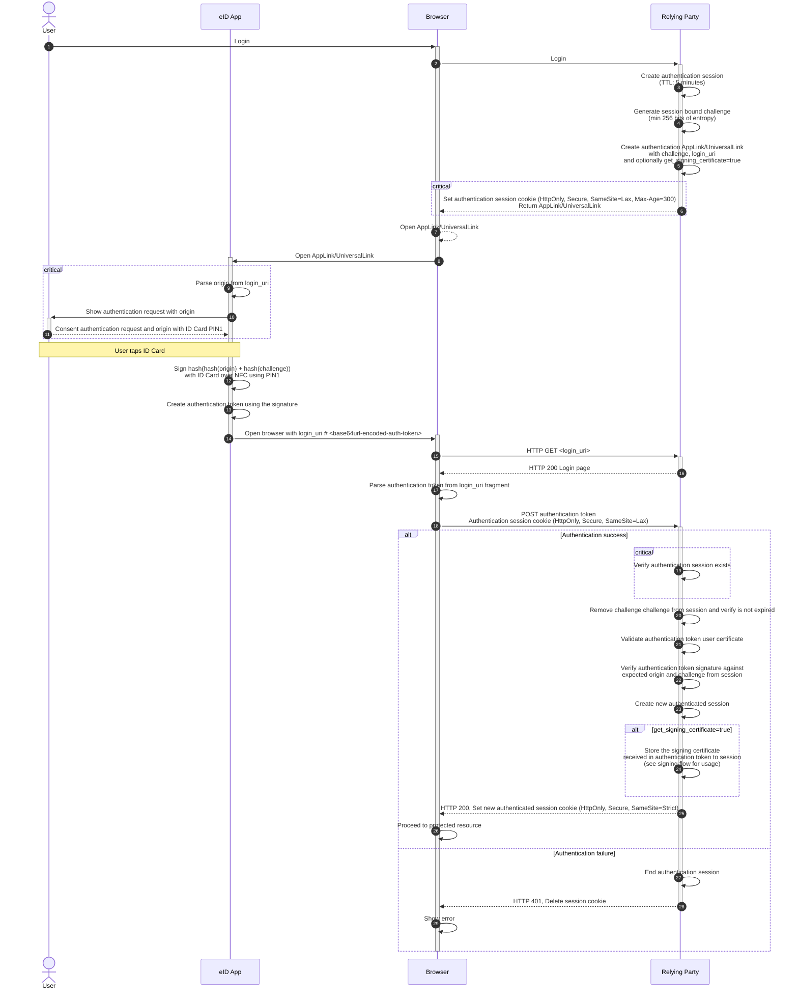
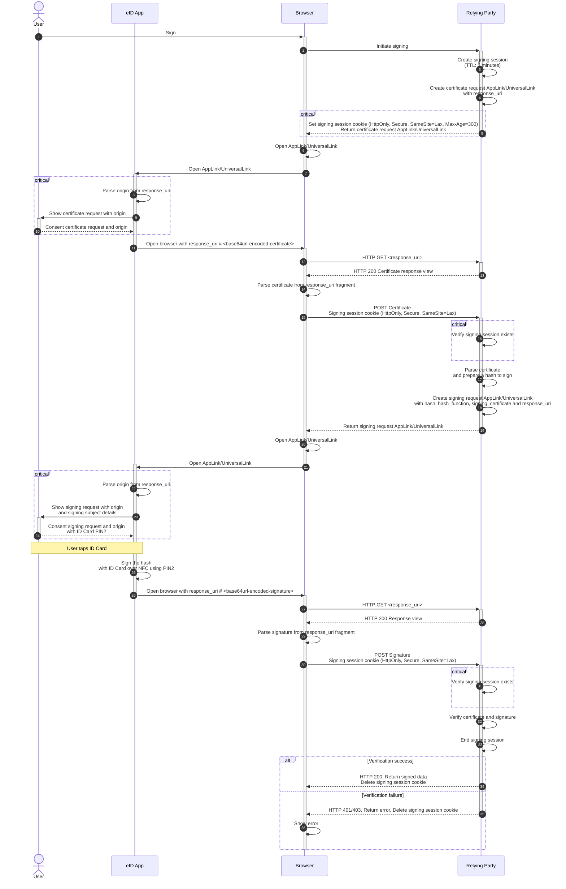

# Web eID for Mobile: electronic identity cards on mobile devices

## Table of Contents

* [Introduction](#introduction)
    * [Use cases](#use-cases)
        * [Authentication](#authentication)
        * [Signing documents](#signing-documents)
    * [Web eID project websites](#web-eid-project-websites)
    * [Requirements notation and conventions](#requirements-notation-and-conventions)
    * [Glossary](#glossary)
* [Design choices](#design-choices)
    * [Problems with the current implementation](#problems-with-the-current-implementation)
    * [Principles of the new technical design](#principles-of-the-new-technical-design)
* [Web eID for Mobile protocol](#web-eid-for-mobile-protocol)
    * [Authentication](#authentication-protocol)
        * [Authentication request](#authentication-request)
        * [Authentication response](#authentication-response)
        * [Error response](#error-response)
    * [Digital signing](#signing-protocol)
        * [Certificate request](#certificate-request)
        * [Certificate response](#certificate-response)
        * [Signing request](#signing-request)
        * [Signing response](#signing-response)
        * [Error response](#error-response-1)
    * [Error codes](#error-codes)
    * [RIA-DigiDoc mobile app](#ria-digidoc-mobile-app)
    * [Security assumptions](#security-assumptions)
    * [Web eID authentication token specification](#web-eid-authentication-token-specification)
        * [Extended token format](#extended-token-format)
        * [Validation libraries](#validation-libraries)
    * [Implementation guide and example applications](#implementation-guide-and-example-applications)

## Introduction

The Web eID for Mobile protocol enables secure *same-device* authentication and digital signing on Android and iOS
devices,
using European Union electronic identity (eID) cards over Near Field Communication (NFC) and public-key cryptography.

It extends the [Web eID protocol](https://github.com/web-eid/web-eid-system-architecture-doc) by adding support for
authentication and digital signing on mobile devices, where Web eID browser extensions are not available.

The solution is cross-platform and works in all modern mobile browsers.

This document defines the functionality and technical design of the Web eID for Mobile protocol.

### Use cases

The solution supports two main use cases – authentication and digital signing of documents.

#### Authentication

The user opens a website that requires authentication with an eID card and initiates the authentication. The website
creates an authentication session and opens
an [App Link](https://developer.android.com/training/app-links)/[Universal Link](https://developer.apple.com/documentation/xcode/supporting-universal-links-in-your-app)
to the [RIA-DigiDoc mobile app](#ria-digidoc-mobile-app) (eID app), which processes the authentication request. The
application asks the user for permission to send the authentication certificate to the website and prompts them to enter
their authentication PIN. The user taps the ID card to the mobile phone's NFC reader, enters the authentication PIN, and
confirms the authentication request. The mobile application directs the user back to the website, where the
authentication session and data are verified. The website notifies the user of a successful login and displays the
signed-in page.

#### Signing documents

The user opens a website that supports digital signing of documents and initiates digital signing. The website creates a
signing session and
opens
an [App Link](https://developer.android.com/training/app-links)/[Universal Link](https://developer.apple.com/documentation/xcode/supporting-universal-links-in-your-app)
to the [RIA-DigiDoc mobile app](#ria-digidoc-mobile-app) (eID app), which processes the signing request. The application
asks the
user for permission to send the signing certificate to the website and prompts them to enter their signing
PIN. The user taps the ID card to the mobile phone's NFC reader, enters the signing PIN, and confirms the signing
request. The mobile application directs the user back to the website, where the signing session and data are verified.
The website notifies the user of a successful signing and displays the signed document.

### Web eID project websites

The Web eID project website, including an authentication and digital signing test web application, is available
at https://web-eid.eu/. Links to Git repositories with the implementation of the Web eID components are available from
the Web eID GitHub organization page https://github.com/web-eid and referenced below under corresponding component
sections.

### Requirements notation and conventions

The key words "MUST", "MUST NOT", "REQUIRED", "SHALL", "SHALL NOT", "SHOULD", "SHOULD NOT", "RECOMMENDED", "NOT
RECOMMENDED", "MAY", and "OPTIONAL" in this document are to be interpreted as described
in [RFC 2119](https://www.rfc-editor.org/rfc/rfc2119.txt).

### Glossary

The following terms and abbreviations are used in this document:

- **APDU**, *application protocol data unit*, the communication unit between a smart card reader and a smart card
- **base64url**, the URL-safe Base64 encoding defined in [RFC 4648, Section 5](https://datatracker.ietf.org/doc/html/rfc4648#section-5),
  without padding
- **challenge nonce** (or challenge, or nonce), a cryptographic nonce, a large random number that can be used only once,
  with at least 256 bits of entropy, hex-encoded for transport (e.g. 64 hex characters for a 256-bit nonce)
- **CSRF**, *Cross-site request forgery*, a type of malicious exploit of a website where unauthorized commands are
  submitted from a user that the web application trusts
- **eID**, *electronic identification*, a digital solution for proof of identity of citizens or organizations
- **LDAP**, *Lightweight Directory Access Protocol*, a protocol for accessing and maintaining distributed directory
  information services, used here to retrieve user certificates from a directory
- **NFC**, *Near Field Communication*, a wireless technology used to communicate with eID smart cards via mobile
  devices
- **OCSP**, *Online Certificate Status Protocol*, an internet protocol for obtaining the revocation status of a X.509
  digital certificate
- **origin**, the website origin (scheme, host, port tuple) as defined
  in [RFC 6454](https://datatracker.ietf.org/doc/html/rfc6454)
- **TLS**, *Transport Layer Security*, a cryptographic protocol for secure Internet communication
- **RIA-DigiDoc mobile app** (also referred to as **eID app**), the official application used on mobile devices to
  access European Union eID cards over NFC for authentication and signing using the Web eID for Mobile protocol.
- **WebExtensions**, a new cross-browser system for developing browser extensions

## Design choices

### Problems with the current implementation

The current [Web eID protocol](https://github.com/web-eid/web-eid-system-architecture-doc) is not usable on mobile
devices due to the lack
of [WebExtensions](https://github.com/web-eid/web-eid-system-architecture-doc/blob/master/README.md#browser-extensions)
support on mobile browsers.

### Principles of the new technical design

To overcome this limitation, a cookie-based protocol is introduced.

The Web eID for Mobile protocol relies on standard mobile OS mechanisms instead of browser extensions. The key design
principles are:

**App Links / Universal Links.** The protocol uses OS-verified deep
links — [App Links](https://developer.android.com/training/app-links) on
Android, [Universal Links](https://developer.apple.com/documentation/xcode/supporting-universal-links-in-your-app) on
iOS — to transition between the mobile browser and the eID application. The operating system verifies domain ownership
of the link before opening the eID app, which prevents malicious applications from intercepting authentication or
signing requests.

**URL fragments for data transfer.** Request parameters (challenge, login URI) and response data (authentication token,
certificates, signatures) are exchanged via the URL fragment (`#`). According to
[RFC 3986](https://www.rfc-editor.org/rfc/rfc3986#section-3.5), fragments are never sent to the server in HTTP
requests — they are only accessible to client-side JavaScript. This avoids leaking sensitive cryptographic material in
server logs, HTTP headers, or referrer URLs.

**Cookie-based session binding.** Since browser extensions are not available on mobile, the protocol uses HTTP cookies
with the `__Host-` prefix and `Secure`, `HttpOnly`, `SameSite=Lax`, `Path=/` attributes to bind the authentication or
signing session
across browser-to-app-to-browser transitions. This ensures the response received from the eID app is linked to the
correct server-side session.

**Stateless browser, stateful server.** The browser acts as a stateless relay: it opens the eID app via a deep link,
receives the result back via a URL fragment, and submits it to the server. All session state — challenges, signing
containers, expiry timers — is maintained server-side, which simplifies the client-side logic and reduces the attack
surface.

**Cross-platform compatibility.** The approach works in all modern mobile browsers because it relies on standard OS
mechanisms (deep links, cookies, URL fragments) rather than browser-specific extension APIs.

## Web eID for Mobile protocol

The authentication and digital signing processes follow the same principle: the eID app uses the
private key on the ID card to sign a server-provided challenge or document hash. The resulting signature and certificate
are sent back to the server for verification.

Authentication uses the authentication key and certificate on eID smart cards, as most cards have separate keys for
authentication and digital signing.

### <a id="authentication-protocol"></a>Authentication



Figure 1: Web eID for Mobile authentication diagram

The authentication steps are as follows:

**Steps 1–2.** The user initiates login in the mobile browser. The browser sends a login request to the Relying Party
(RP).

**Steps 3–5.** The RP creates a new authentication session with a time-to-live of no more than 5 minutes (recommended), generates a
cryptographically random challenge with at least 256 bits of entropy, and builds an AppLink/UniversalLink containing the
challenge, login URI, and optionally a `get_signing_certificate=true` flag. When this flag is set, the eID app will
include the user's signing certificate and supported signature algorithms in the authentication token, allowing the RP
to
skip the certificate request phase of the signing flow later.

**Step 6.** The RP sets an authentication session cookie (`__Host-auth-session`; `Secure`, `HttpOnly`, `SameSite=Lax`,
`Max-Age=300`) and returns the AppLink/UniversalLink to the browser. The cookie binds subsequent requests to this authentication
session. The `SameSite=Lax` attribute is required so that the cookie is sent with the top-level navigation triggered
when the eID app redirects back to the browser.

**Steps 7–8.** The browser opens the AppLink/UniversalLink. The operating system verifies the domain ownership of the
link and launches the eID app.

**Steps 9–11.** The eID app parses and validates the `login_uri` from the URL fragment and extracts the origin. It
displays the authentication request to the user, showing the origin of the requesting website. The user reviews the
request and consents by entering their ID card PIN1.

**Step 12.** The eID app computes `hash(hash(origin) + hash(challenge))` and signs the result with the ID card's
authentication key over NFC using PIN1. The user taps the ID card to the phone's NFC reader during this step.

**Step 13.** The eID app creates an authentication token containing the authentication certificate, signature, and
algorithm. The token format is `web-eid:1.0` when only authentication data is included, or `web-eid:1.1` when the
signing certificate and supported signature algorithms are also included (if `get_signing_certificate=true` was
requested).

**Step 14.** The eID app opens the browser with the `login_uri` appended with a URL fragment containing the
base64url-encoded authentication token (e.g. `https://rp.example.com/auth/eid/login#<base64url-encoded-auth-token>`).
The authentication token is carried in the fragment so it is never sent to the server in the HTTP request.

**Steps 15–16.** The browser makes an HTTP GET request to the `login_uri`. The RP responds with an HTTP 200 login page
that contains JavaScript to process the authentication token.

**Steps 17–18.** The JavaScript on the login page parses the authentication token from the URL fragment and
automatically submits it to the RP via an HTTP POST request. The authentication session cookie (`__Host-auth-session`)
is
included with the request, binding it to the session created in steps 3–5.

**Steps 19–20.** The RP verifies that the authentication session identified by the session cookie exists and is valid.
It
then verifies that the challenge is stored in the session, removes it and verifies that it has not expired.

**Step 21.** The RP validates the user certificate from the authentication token. The server application extracts the
user certificate from the authentication token and performs the following validation steps:

- validates that the current time falls within the authentication certificate's validity period
- validates that the purpose of the authentication certificate's key usage is client authentication
- validates that the authentication certificate does not contain any disallowed policies
- validates that the authentication certificate is signed by a trusted certificate authority
- validates the certificate revocation status response from the OCSP responder

**Step 22.** It then verifies the authentication token signature by recomputing `hash(hash(origin) + hash(challenge))`
using the expected origin from server configuration and the challenge from the session, and validating the signature
against the authentication certificate.

**Steps 23–24.** On success, the RP creates a new authenticated session. If the authentication token format is
`web-eid:1.1`, the RP optionally stores the signing certificate and supported signature algorithms from the token into
the session for later use in the signing flow.

**Steps 25–26.** The RP returns HTTP 200, sets a new authenticated session cookie (`__Host-auth-session`; `Secure`,
`HttpOnly`,
`SameSite=Strict`) and directs the browser to the protected resource. The cookie is upgraded from `SameSite=Lax` to
`SameSite=Strict` because cross-application navigation is no longer required after authentication completes, and
`Strict` provides stronger CSRF protection for the authenticated session.

**Steps 27–29.** On failure, the RP ends the authentication session, deletes the session cookie by setting its
`Max-Age` to 0, and returns HTTP 401 Unauthorized. The browser displays an error to the user.

#### Authentication request

Authentication request AppLink/UniversalLink format:

https://mopp.ria.ee/auth#base64url-encoded-request

Decoded URI fragment payload:

```json
{
  "challenge": "e3b0c44298fc1c149afbf4c8996fb92427ae41e4649b934ca495991b7852b855",
  "login_uri": "https://rp.example.com/auth/eid/login",
  "get_signing_certificate": true
}
```

#### Authentication response

Authentication response URI format:

<login_uri>#base64url-encoded-response

Decoded URI fragment payload:

```json
{
  "auth_token": {
    "unverifiedCertificate": "MIIFozCCA4ugAwIBAgIQHFpdK-zCQsFW4...",
    "algorithm": "ES384",
    "signature": "HBjNXIaUskXbfhzYQHvwjKDUWfNu4yxXZha...",
    "unverifiedSigningCertificate": "MIIFikACB3ugAwASAgIHHFrtdZ-zeQsas1...",
    "supportedSignatureAlgorithms": [
      {
        "cryptoAlgorithm": "ECC",
        "hashFunction": "SHA-384",
        "paddingScheme": "NONE"
      }
    ],
    "format": "web-eid:1.1",
    "appVersion": "https://web-eid.eu/web-eid-app/releases/v2.0.0"
  }
}
```

#### Error response

Error response URI format:

<login_uri>#base64url-encoded-response

Decoded URI fragment payload:

```json
{
  "error": true,
  "code": "ERR_WEBEID_MOBILE_INVALID_REQUEST",
  "message": "Invalid challenge length"
}
```

### <a id="signing-protocol"></a>Digital signing



Figure 2: Web eID for Mobile digital signing diagram

The digital signing steps are as follows:

The digital signing flow consists of two phases: a **certificate phase** (steps 1–19) in which the RP obtains the user's
signing certificate, and a **signature phase** (steps 20–36) in which the actual hash is signed. The certificate phase
can be skipped if the user was authenticated using `get_signing_certificate=true` or the user's signing certificate is
obtained
from LDAP. When the certificate phase is skipped, the RP uses the stored signing certificate to prepare the hash and
builds the signing request AppLink/UniversalLink directly, entering the flow at the signature phase (step 20).

#### Certificate phase

**Steps 1–2.** The user initiates signing in the mobile browser. The browser sends a signing initiation request to the
Relying Party (RP).

**Steps 3–4.** The RP creates a new signing session with a time-to-live of no more than 5 minutes (recommended) and prepares references to the
data that will be signed. It builds a certificate request AppLink/UniversalLink containing the `response_uri` where the
eID app should return the signing certificate (e.g. `https://rp.example.com/sign/eid/certificate`).

**Step 5.** The RP sets a signing session cookie (`__Host-eid-sign`; `Secure`, `HttpOnly`, `SameSite=Lax`,
`Max-Age=300`) and returns the certificate request AppLink/UniversalLink to the browser. The cookie binds subsequent
requests to this signing session.

**Steps 6–7.** The browser opens the AppLink/UniversalLink. The operating system verifies the domain ownership of the
link and launches the eID app.

**Steps 8–10.** The eID app parses and validates the `response_uri` from the URL fragment and extracts the origin. It
displays the certificate request to the user, showing the origin of the requesting website. The user reviews the request
and consents.

**Step 11.** The eID app opens the browser with the `response_uri` appended with a URL fragment containing the
base64url-encoded signing certificate and supported signature algorithms (e.g.
`https://rp.example.com/sign/eid/certificate#<base64url-encoded-certificate>`).

**Steps 12–13.** The browser makes an HTTP GET request to the `response_uri`. The RP responds with an HTTP 200
certificate response page that contains JavaScript to process the certificate.

**Steps 14–15.** The JavaScript on the page parses the signing certificate from the URL fragment and automatically
submits it to the RP via an HTTP POST request. The signing session cookie (`__Host-eid-sign`) is included with the
request, binding it to the session created in steps 3–4.

**Step 16.** The RP verifies that the signing session identified by the session cookie exists and is valid.

**Steps 17–18.** The RP parses the signing certificate and prepares the data to sign using the certificate and
supported signature algorithms, producing an unsigned container with a hash and hash function. The RP builds a signing
request AppLink/UniversalLink containing the `hash`, `hash_function`, `signing_certificate`, and a new `response_uri`
for the signature (e.g. `https://rp.example.com/sign/eid/signature`).

**Step 19.** The RP returns the signing request AppLink/UniversalLink to the browser along with an updated signing
session cookie.

#### Signature phase

**Steps 20–21.** The browser opens the signing request AppLink/UniversalLink. The operating system verifies the domain
ownership of the link and launches the eID app.

**Steps 22–24.** The eID app parses and validates the `response_uri` from the URL fragment and extracts the origin. It
displays the signing request to the user, showing the origin and details (given name, surname, personal ID code) of the
requested signing subject. The user reviews the request and consents by entering their ID card PIN2.

**Step 25.** The eID app signs the `hash` received from the RP with the ID card's signing key over NFC using PIN2. The
user taps the ID card to the phone's NFC reader during this step.

**Step 26.** The eID app opens the browser with the `response_uri` appended with a URL fragment containing the
base64url-encoded signature and signature algorithm (e.g.
`https://rp.example.com/sign/eid/signature#<base64url-encoded-signature>`).

**Steps 27–28.** The browser makes an HTTP GET request to the `response_uri`. The RP responds with an HTTP 200 response
page that contains JavaScript to process the signature.

**Steps 29–31.** The JavaScript on the page parses the signature from the URL fragment and automatically submits it to
the RP via an HTTP POST request. The signing session cookie (`__Host-eid-sign`) is included with the request. The RP
verifies that the signing session identified by the session cookie exists and is valid.

**Steps 32–33.** The RP verifies the signing certificate (validity period, key usage extensions, OCSP revocation
status). The RP verifies the signature against the unsigned container prepared in steps 17–18 and finalizes the
signed container. The RP ends the signing session.

**Steps 34–36.** On success, the RP returns the signed data to the browser and deletes the signing session cookie. On
failure, the browser displays an error to the user and the signing session cookie is deleted.

#### Certificate request

Certificate request AppLink/UniversalLink format:

https://mopp.ria.ee/cert#base64url-encoded-request

Decoded URI fragment payload:

```json
{
  "response_uri": "https://rp.example.com/sign/eid/certificate"
}
```

#### Certificate response

Certificate response URI format:

<response_uri>#base64url-encoded-response

Decoded URI fragment payload:

```json
{
  "certificate": "MIIFikACB3ugAwASAgIHHFrtdZ-zeQsas1...",
  "supportedSignatureAlgorithms": [
    {
      "cryptoAlgorithm": "ECC",
      "hashFunction": "SHA-256",
      "paddingScheme": "NONE"
    },
    {
      "cryptoAlgorithm": "ECC",
      "hashFunction": "SHA-384",
      "paddingScheme": "NONE"
    },
    {
      "cryptoAlgorithm": "ECC",
      "hashFunction": "SHA-512",
      "paddingScheme": "NONE"
    }
  ]
}
```

#### Signing request

Signing request AppLink/UniversalLink format:

https://mopp.ria.ee/sign#base64url-encoded-request

Decoded URI fragment payload:

```json
{
  "hash": "e3b0c44298fc1c149afbf4c8996fb92427ae41e4649b934ca495991b7852b855",
  "hash_function": "SHA-256",
  "signing_certificate": "MIIFikACB3ugAwASAgIHHFrtdZ-zeQsas1...",
  "response_uri": "https://rp.example.com/sign/eid/signature"
}
```

#### Signing response

Signing response URI format:

<response_uri>#base64url-encoded-response

Decoded URI fragment payload:

```json
{
  "signature": "HBjNXIaUskXbfhzYQHvwjKDUWfNu4yxXZha...",
  "signature_algorithm": {
    "cryptoAlgorithm": "ECC",
    "hashFunction": "SHA-256",
    "paddingScheme": "NONE"
  }
}
```

#### Error response

Error response URI format:

<response_uri>#base64url-encoded-response

Decoded URI fragment payload:

```json
{
  "error": true,
  "code": "ERR_WEBEID_MOBILE_INVALID_REQUEST",
  "message": "Invalid challenge length"
}
```

### Error codes

The eID app returns the following error codes in the error response:

- `ERR_WEBEID_MOBILE_INVALID_REQUEST` — the request received by the eID app is invalid (e.g. malformed URI, invalid
  challenge length, unsupported parameters).
- `ERR_WEBEID_MOBILE_UNKNOWN_ERROR` — application error.

If the user cancels the authentication or signing request, the eID app does not return an error. Instead, the eID app
closes and the user is returned to the browser where the authentication or signing request was initiated.

### RIA-DigiDoc mobile app

The RIA-DigiDoc mobile app is the official application that supports Web eID for Mobile protocol. The app is developed
by the Estonian Information System Authority (RIA) and is available on
the [Google Play Store](https://play.google.com/store/apps/details?id=ee.ria.DigiDoc)
and [Apple App Store](https://apps.apple.com/app/ria-digidoc/id1216104448). The app is open source and its source
code is available in the [RIA-DigiDoc-Android](https://github.com/open-eid/RIA-DigiDoc-Android)
and [RIA-DigiDoc-iOS](https://github.com/open-eid/RIA-DigiDoc-iOS) GitHub repositories.

> The RIA-DigiDoc mobile app AppLink/UniversalLink is https://mopp.ria.ee
> If the user has not installed the RIA-DigiDoc mobile app, the AppLink/UniversalLink will direct them to the app store to
> install it.

### Security assumptions

The security of the Web eID for Mobile protocol relies on the following assumptions:

- The relying party must correctly implement the protocol and securely validate authentication tokens and signatures
  according to the specification. Using the cookies and validating the session state as described in the protocol is
  critical to prevent MITM and replay attacks.
- The relying party must use the official RIA-DigiDoc mobile app AppLink/UniversalLink https://mopp.ria.ee, ensuring
  that
  only the legitimate eID app can receive the authentication and signing requests. This prevents malicious apps from
  intercepting or forging requests.
- The user shall correctly verify the origin and details of authentication and signing requests in the eID app and only
  consent to legitimate requests. User education and clear UI design in the eID app are important to mitigate phishing
  risks.
- RIA-DigiDoc mobile app must only accept requests in the formats defined by the specification and must parse the
  `origin`, which must be shown to the user for consent, from the `login_uri` and `response_uri` request parameters.
- The `login_uri` and `response_uri` parameters must use the HTTPS scheme, must be valid URLs, and should have a
  maximum origin length of 255 characters. The eID app must reject requests with malformed or non-HTTPS URIs.
- The relying party's login and response pages must be free of cross-site scripting (XSS) vulnerabilities, as the
  JavaScript on these pages reads sensitive data (authentication tokens, certificates, signatures) from URL fragments.
  Relying parties should deploy Content Security Policy (CSP) headers to mitigate XSS risks.
- When the signing certificate stored in the session via `get_signing_certificate=true` is used in the signing flow, the
  relying party must fully validate the certificate (issuer chain, OCSP revocation status, key usage) before using it to
  prepare the hash to sign.
- The relying party's POST endpoints that accept authentication tokens, certificates, and signatures use
  `SameSite=Lax` session cookies as the baseline CSRF mitigation, which prevents cross-site POST requests from
  including the session cookie. For the authentication POST endpoint, the session-bound challenge nonce embedded in
  the authentication token provides additional implicit CSRF protection. However, the certificate and signature POST
  endpoints in the signing flow do not carry a session-bound challenge and rely solely on `SameSite=Lax`. Since
  `SameSite` operates on the registrable domain level ("site"), not on origin, it does not protect against same-site
  attacks (e.g., from a compromised subdomain). Relying parties SHOULD implement additional CSRF protection mechanisms
  (e.g., synchronizer tokens) for the certificate and signature POST endpoints.
- The eID app shall verify that the `signing_certificate` received in the signing request matches the signing
  certificate on the user's physical ID card before proceeding with signing.

### Web eID authentication token specification

Web eID for Mobile protocol uses the same base authentication token as defined
in [Web eID protocol](https://github.com/web-eid/web-eid-system-architecture-doc/blob/master/README.md#web-eid-authentication-token-specification).

#### Extended token format

To support skipping the [certificate request flow](#certificate-phase) described in
the [digital signing flow](#signing-protocol), the Web eID authentication token is extended with a
new format version, `web-eid:1.1`, and two additional fields, `unverifiedSigningCertificate` and
`supportedSignatureAlgorithms`:

```json
{
  "unverifiedCertificate": "MIIFozCCA4ugAwIBAgIQHFpdK-zCQsFW4...",
  "algorithm": "RS256",
  "signature": "HBjNXIaUskXbfhzYQHvwjKDUWfNu4yxXZha...",
  "unverifiedSigningCertificate": "MIIFikACB3ugAwASAgIHHFrtdZ-zeQsas1...",
  "supportedSignatureAlgorithms": [
    {
      "cryptoAlgorithm": "ECC",
      "hashFunction": "SHA-384",
      "paddingScheme": "NONE"
    }
  ],
  "format": "web-eid:1.1",
  "appVersion": "https://web-eid.eu/web-eid-app/releases/v2.0.0"
}
```

#### Validation libraries

The Web eID project provides official reference implementations of the Web eID authentication token validation algorithm
for Java, .NET and PHP. The reference implementations also include secure challenge nonce generation as required by the
Web
eID authentication protocol. The reference implementations are distributed as libraries to make them easy to integrate
into applications that intend to use Web eID authentication.

Java applications can use the `web-eid-authtoken-validation-java` library. The full specification of the library API and
its source code is available in the
`web-eid-authtoken-validation-java` [GitHub repository](https://github.com/web-eid/web-eid-authtoken-validation-java).

.NET applications can use the `web-eid-authtoken-validation-dotnet` library. The full specification of the library API
and its source code is available in the
`web-eid-authtoken-validation-dotnet` [GitHub repository](https://github.com/web-eid/web-eid-authtoken-validation-dotnet).

PHP applications can use the `web-eid-authtoken-validation-php` library. The full specification of the library API
and its source code is available in the
`web-eid-authtoken-validation-php` [GitHub repository](https://github.com/web-eid/web-eid-authtoken-validation-php).

### Implementation guide and example applications

To implement authentication and digital signing with Web eID for Mobile in a Java, .NET or PHP web application,
follow the steps below:

- in the back end of a Java web application,
    - for authentication, use the *web-eid-authtoken-validation-java* Java library according to
      instructions [here](https://github.com/web-eid/web-eid-authtoken-validation-java#quickstart),
    - for digital signing, use the *digidoc4j* Java library according to
      instructions [here](https://github.com/open-eid/digidoc4j/wiki/Examples-of-using-it),
- in the back end of a .NET web application,
    - for authentication, use the *web-eid-authtoken-validation-dotnet* .NET library according to
      instructions [here](https://github.com/web-eid/web-eid-authtoken-validation-dotnet#quickstart),
    - for digital signing, use the C# bindings of the `libdigidocpp` library according to
      instructions [here](https://github.com/web-eid/web-eid-asp-dotnet-example/wiki/How-to-implement-digital-signing-in-a-.NET-web-application-back-end).
- in the back end of a PHP web application,
    - for authentication, use the *web-eid-authtoken-validation-php* PHP library according to
      instructions [here](https://github.com/web-eid/web-eid-authtoken-validation-php#quickstart),
    - digital signing in PHP is not currently covered by the Web eID project libraries.

The full source code and overview of an example Spring Boot web application that uses Web eID for Mobile protocol
authentication and digital signing is
available [here](https://github.com/web-eid/web-eid-authtoken-validation-java/tree/main/example). The
.NET/C# version of the same example is
available [here](https://github.com/web-eid/web-eid-authtoken-validation-dotnet/tree/main/example). The PHP version of
the example application is
available [here](https://github.com/web-eid/web-eid-authtoken-validation-php/tree/main/example).
